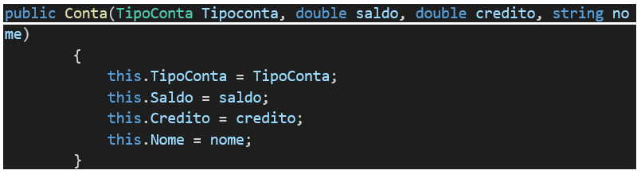
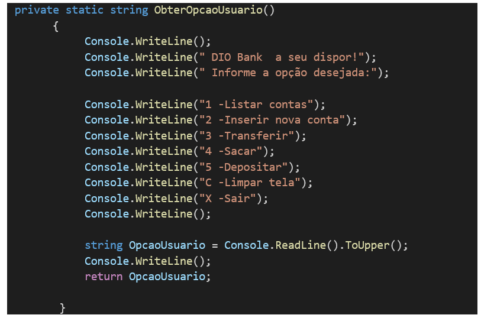

<h1>CRIANDO UMA APLICAÇÃO DE TRANSFERENCIA BANCÁRIA </h1>

Nesse projeto foi criado uma aplicação simples simulando um aplicativo de banco. Onde não utilizamos banco de dados somente dados em memória. Foi feito através do Visual Studio Code.

<h2>PASSO A PASSO </h2>

<li>Abrir o Git Bash e selecionar a pasta desejada com os comandos</li>
<ol>
<li>cd Digital Innovation One </li>
<li>dotnet new console </li>
<li>DIO.Bank </li>
<li>code DIO.Bank </li>
</ol>

•	Criado Classe Conta. Atributos como privado para proteção dos dados. 

•	No arquivo Program foi criado uma instancia para o objeto.  
<strong>Conta minhaConta = new Conta { }; </strong>

•	Criado uma nova pasta Enum onde no arquivo TipoConta que serve como uma seleção de categoria. Neste caso foi usado contas de pessoas físicas ou jurídicas.
namespace DIO.Bank.

•	Na Conta foi chamado um método tipo construtor que é chamado no momento que é criado um objeto.
public Conta(TipoConta Tipoconta, double saldo, double credito, string nome)
        

•	Método Sacar, retirar um saldo da conta. O saldo não pode ficar negativo mais que o valor que cada cliente possui de cheque especial.
 public bool Sacar(double valorSaque)
        
        

•	Nessa classe mostra o valor de depósito que cai na conta.

•	Classe com a função Transferir um dinheiro de uma conta para outra.
public void Transferir(double valorTransferencia, Conta contaDestino)

        

•	Reescrever o método To String para retornar uma string com os dados, saber o que acontece na aplicação.
public override string ToString()

        

•	Ao realizar um run conseguimos visualizar  

 

 
•	Na Main do programa principal Program mostra a opção para usuário selecionar em qual menu o mesmo deseja entrar.
 private static string ObterOpcaoUsuario()
      
      

•	Após o usuário selecionar o menu que deseja entrar, foi utilizado um While onde enquanto o usuário não clicar em X (sair) ele utiliza um switch com os cases na qual foi usado cada método privado específico.

•	Cada método foi detalhado conforme abaixo:  
private static void TransferirConta()
        {
             Console.WriteLine("Digite o número da conta de origem: ");
            int indiceContaOrigem = int.Parse(Console.ReadLine());

            Console.Write("Digite o número da conta de destino: ");
             int indiceContaDestino = int.Parse(Console.ReadLine());

             Console.Write("Digite o valor a ser transferido: ");
            double valorTransferencia = double.Parse(Console.ReadLine());

            listContas[indiceContaOrigem].Transferir(valorTransferencia, listContas[indiceContaDestino]);
        }

        private static void Depositar()
        {
            Console.WriteLine("Digite o número da conta: ");
            int indiceConta = int.Parse(Console.ReadLine());

            Console.Write("Digite o valor a ser depositado: ");
             double valorDeposito = double.Parse(Console.ReadLine());

             listContas[indiceConta].Depositar(valorDeposito);
        }

        private static void Sacar()
        {
            Console.WriteLine("Digite o  número da conta: ");
            int indiceConta = int.Parse(Console.ReadLine());

            Console.Write("Digite  o valor a ser sacado: ");
             double valorSaque = double.Parse(Console.ReadLine());

             listContas[indiceConta].Sacar(valorSaque);

        }

        private static void ListarContas()
        {
            Console.WriteLine("Listar contas");
            if (listContas.Count ==0)
            {
                Console.WriteLine("Nenhuma conta cadastrada.");
                return;
            }
            for ( int i = 0; i < listContas.Count; i++)
            {
                Conta conta = listContas[i];
                Console.Write("#{0} - ", i);
                Console.WriteLine(conta); // executa o ToString que vai mostrar os dados da conta.
            }
        }

        private static void InserirConta()
        {
            Console.WriteLine("Inserir nova conta");
            
            Console.Write("Digite 1 para Conta Física ou 2 para Jurídica:");
            int entradaTipoConta = int.Parse(Console.ReadLine());

            Console.Write("Digite o Nome do Cliente:");
            string entradaNome = Console.ReadLine();

            Console.Write("Digite o Saldo Inicial:");
            double entradaSaldo = double.Parse(Console.ReadLine());

            Console.Write("Digite o Crédito:");
            double entradaCredito = double.Parse(Console.ReadLine());

            Conta novaConta = new Conta(tipoConta: (TipoConta) entradaTipoConta,
                                         saldo: entradaSaldo,
                                         credito: entradaCredito,
                                         nome: entradaNome);
             
            listContas.Add(novaConta);
        }

